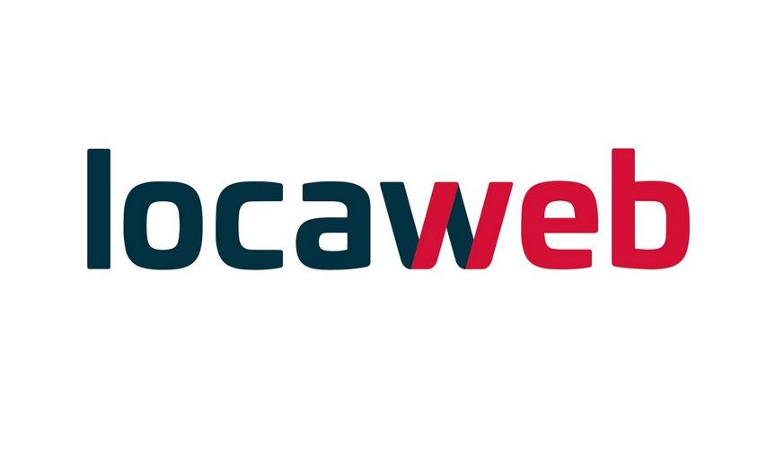

# SmtpLW - Locaweb SMTP API client

The [Locaweb dedicated SMTP service](https://www.locaweb.com.br/smtp-locaweb/) API client.

[](https://github.com/guibranco/SmtpLw)
[](https://wakatime.com/badge/github/guibranco/SmtpLw)



## CI/CD

| Build status | Last commit | Tests | Coverage | Code Smells | LoC |
|--------------|-------------|-------|----------|-------------|-----|
| [](https://ci.appveyor.com/project/guibranco/smtplw) | [](https://github.com/guibranco/smtplw) | [](https://ci.appveyor.com/project/guibranco/smtplw) | [](https://sonarcloud.io/dashboard?id=guibranco_SmtpLw) | [](https://sonarcloud.io/dashboard?id=guibranco_SmtpLw) | [](https://sonarcloud.io/dashboard?id=guibranco_SmtpLw) |

## Code Quality

[](https://www.codacy.com/gh/guibranco/SmtpLw/dashboard?utm_source=github.com\&utm_medium=referral\&utm_content=guibranco/SmtpLw\&utm_campaign=Badge_Grade)
[](https://www.codacy.com/gh/guibranco/SmtpLw/dashboard?utm_source=github.com\&utm_medium=referral\&utm_content=guibranco/SmtpLw\&utm_campaign=Badge_Grade)
[](https://codecov.io/gh/guibranco/smtplw)

[](https://codeclimate.com/github/guibranco/SmtpLw/maintainability)
[](https://codeclimate.com/github/guibranco/SmtpLw/test_coverage)

[](https://sonarcloud.io/dashboard?id=guibranco_SmtpLw)
[](https://sonarcloud.io/dashboard?id=guibranco_SmtpLw)

[](https://sonarcloud.io/dashboard?id=guibranco_SmtpLw)
[](https://sonarcloud.io/dashboard?id=guibranco_SmtpLw)

[](https://sonarcloud.io/dashboard?id=guibranco_SmtpLw)
[](https://sonarcloud.io/dashboard?id=guibranco_SmtpLw)

[](https://sonarcloud.io/dashboard?id=guibranco_SmtpLw)
[](https://sonarcloud.io/dashboard?id=guibranco_SmtpLw)

***

## Installation

### Github Releases

[](https://github.com/guibranco/SmtpLw) [](https://github.com/guibranco/SmtpLw)

Download the latest zip file from the [Release](https://github.com/GuiBranco/SmtpLw/releases) page.

### Nuget package manager

| Package | Version | Downloads |
|------------------|:-------:|:-------:|
| **SmtpLw** | [](https://www.nuget.org/packages/SmtpLw/) | [](https://www.nuget.org/packages/SmtpLw/) |

***

## Features

Implements all features of Locaweb SMTP API available at [SMTP Localweb API docs](http://developer.locaweb.com.br/documentacoes/smtp/api-como-utilizar/)

*   Send message
*   Get message status

***

## Usage

```cs

var client = new SmtpLwClient("my-auth-token");

var message = new MessageModel {
  Subject = "Some mail subject",
  Body = "Message body content!<br /> <b>HTML content</b> or plain text.",
  To = "destination@domain.com",
  From = "configured-from@mydomain.com",
  Headers = new Dictionary<string, string> { { "content-type","text/html"} }
};

var messageId = await client.SendMessageAsync(message, CancellationToken.None).ConfigureAwait(false);

Console.WriteLine("Message Id: {0}", messageId);

```

***
